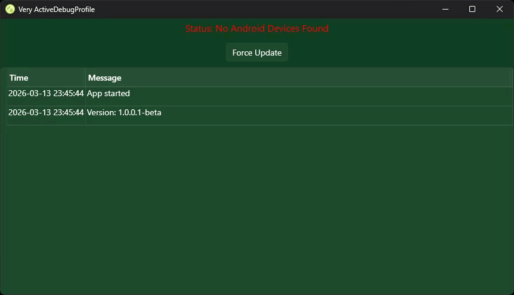

# Very ActiveDebugProfile

A Windows WPF utility that monitors Android device connections and automatically manages Visual Studio debugging profiles.

## Overview

Very ActiveDebugProfile is an application that:
- 🔌 Monitors Android device connections/disconnections in real-time
- 🛠️ Tracks running Visual Studio instances and updates user project files to use the connected Android device
- 📱 Detects device changes using Windows Device Notifications API
- 💾 Persists window placement across sessions
- 🔔 Shows balloon notifications for device events

## Features

### Real-Time Device Monitoring
- Uses Windows `RegisterDeviceNotification` API for instant device detection
- Supports USB and Windows Portable Device (WPD) interfaces
- Identifies Android devices by vendor ID (Samsung, Google, LG, Motorola, etc.)
- Displays friendly device names (e.g., "SM-908U", "Pixel 7")

### Visual Studio Integration
- Enumerates running Visual Studio instances
- Updates any open MAUI projects and updates the .csproj.user file to use the connected device

### System Integration
- Runs in system tray (minimizes to tray) (not yet implemeted)
- Balloon notifications for device events
- Persists window size and position
- Activity log with automatic history management (last 100 entries)

## Requirements

- Windows 10 version 22621 or later
- .NET 10 Runtime
- Visual Studio 2022/2026 (for development)
- Android device with USB debugging enabled (for testing)

## Installation

### From Releases (not yet implemented)
1. Download the latest release from [Releases](https://github.com/anotherlab/VeryActiveDebugProfile/releases)
2. Extract to your preferred location
3. Run `VeryActiveDebugProfile.exe`

### From Source
Clone the repo and build it